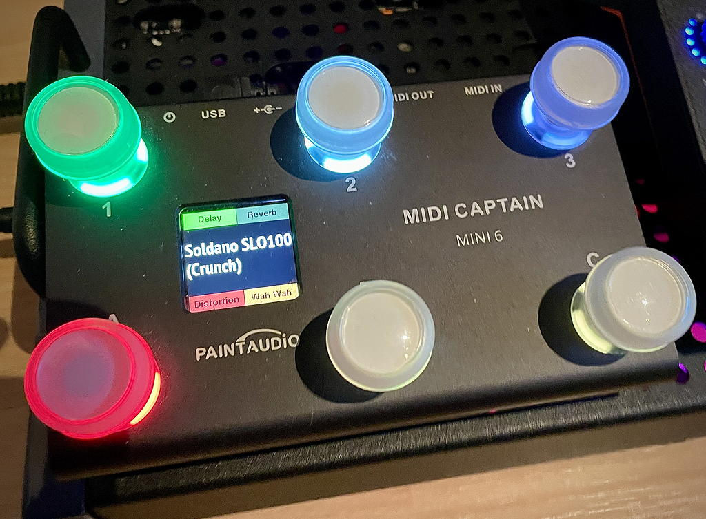

# MidiCaptain4Kemper
alternative firmware for MidiCaptain footswitches to interact with Kemper Profiler

This extension is set on original [PaintAudio firmware 3.5](https://cdn.shopify.com/s/files/1/0656/8312/8548/files/FW_MINI6_KPP_V3.51.zip?v=1711205983)

<h2>Installation</h2>
You need a connection from MIDI Capatain to your computer. This must be done like:

1. Connect Midi Captain with your computer via USB cable.
2. Press and hold switch 1 (first in top line) while you turn on your MIDI Captian.
You should now see your device as MIDICAPTAIN on your computer.

3. Than you can copy the files from the source (src) directory to your MIDI Captain device.

Now you have different firmware version on your device available. 

<h2>Change between installed Firmware</h2>
By pressing a switch while turning on your MIDI captain you can choose:

foot switch 1 - enabling USB disk for conniction to your computer  
foot switch 2 - using PaintAudio firmware for KPP 3.5  
foot switch 3 - MIDI Captain control and request values from KPP via MIDI commands  
foot switch A - bidirectional communication between KPP and MIDI Captain  

<h2>Features of bidirectional Firmware</h2>
* Switch LED color reflects to effect typ of the associated slot. 
* Switch LED brightness reflects effects on/off state
* Switch status follows changes on KPP
* Display shows effects types names of 4 slots
* Rig name is also shown
* and new: while tuning your guitar you see tuning note name
