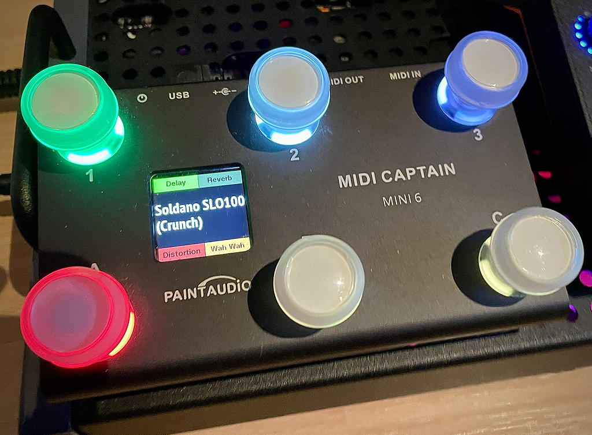
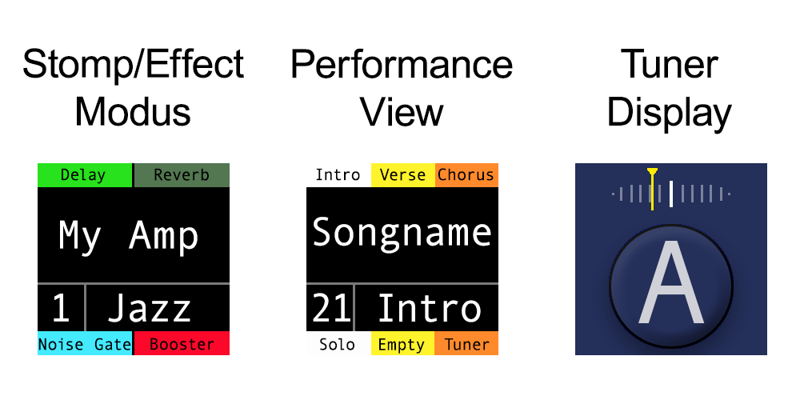
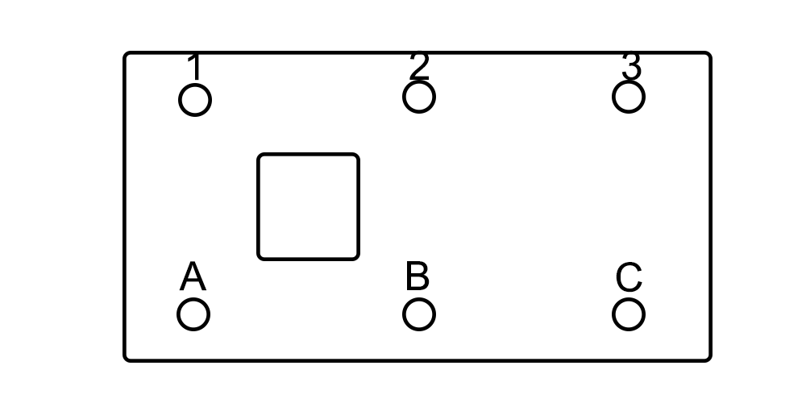

# MidiCaptain4Kemper
alternative firmware for MidiCaptain footswitches to interact with Kemper Profiler

This extension is set on original [PaintAudio firmware 3.5](https://cdn.shopify.com/s/files/1/0656/8312/8548/files/FW_MINI6_KPP_V3.51.zip?v=1711205983)

<h2>Three different views will be shown</h2>

<h3>Stomp / Effect View</h3>
Display shows rig name, bank number and name extension that is in '()' in rig name.
Also there are four fields with assigned slot/effects and corresponding name and Kemper color.
  
Default foot switch assignment:

|            | Short Press              | Long Press                 |  
|------------|--------------------------|----------------------------|
| Switch 1   | Select Stomp 1           |                            |
| Switch 2   | Select Stomp 2           |                            |
| Switch 3   | Bank up                  | Bank up                    |
| Switch A   | Effect State Slot A      | switch to performance view |
| Switch B   | Effect State Slot B      |                            |
| Switch C   | Tuner                    | Bank down                  |

color shema of the foot switch leds:
- using of Kemper color shema for effect groups
- bright led light, effect is active
- low led light, effect is inactive
- no led light, no effect is assigned to the slot

<h3>Performance View</h3>
Display shows rig name, bank number and name extension that is in '()' in rig name.
Also there are six fields. Five represents rigs in the bank. If rignames have substrings with '()' than this substring will be shown. I use it for showing amp setting 'clean', 'crunch',... or song parts 'Intro', 'Chorus', ...
  
Default foot switch assignment:

|            | Short Press              | Long Press                 |  
|------------|--------------------------|----------------------------|
| Switch 1   | rig 1 in the bank        |                            |
| Switch 2   | rig 2 in the bank        |                            |
| Switch 3   | rig 3 in the bank        | Bank up                    |
| Switch A   | rig 4 in the bank        | switch to stop/effect view |
| Switch B   | rig 5 in the bank        |                            |
| Switch C   | Tuner                    | Bank down                  |

color shema of the foot switch leds:
- green, default color for a rig foot switch
- red, active rig
- blue, active rig with active morphing

You can activate morphing by a second tip on the active rig foot switch. And with an additinal tip you deactivate it again.

<h3>Tuner View</h3>
Display shows tuning note of the string and flowting tuning info.

<h2>Installation</h2>
You need a connection from MIDI Capatain to your computer. This must be done like:

1. Connect Midi Captain with your computer via USB cable.
2. Press and hold switch 1 (first in top line) while you turn on your MIDI Captian.
You should now see your device as MIDICAPTAIN on your computer.

3. Than you can copy the files from the source (src) directory to your MIDI Captain device.

Now you have different firmware version on your device available. 

<h2>Change between installed Firmware</h2>

By pressing a switch while turning on your MIDI captain you can choose:

foot switch 1 - enabling USB disk for conniction to your computer  
foot switch 2 - using PaintAudio firmware for KPP 3.5  
foot switch 3 - MIDI Captain control and request values from KPP via MIDI commands  
foot switch A - bidirectional communication between KPP and MIDI Captain  

<h2>Benefit of bidirectional Firmware</h2>

- Switch status follows changes on KPP
- Switch LED color reflects to effect typ of the associated slot 
- Switch LED brightness reflects effects on/off state 
- Display shows effects types names of 4 slots
- Rig name is also shown
- while tuning your guitar you see tuning note name and tuning info

